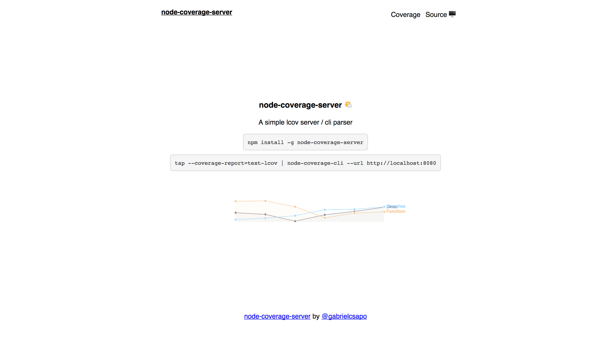

# node-coverage-server

[](https://greenkeeper.io/)

[](https://www.npmjs.com/package/node-coverage-server)
[](https://travis-ci.org/gabrielcsapo/node-coverage-server)
[](https://node-coverage-server.herokuapp.com/coverage/github/gabrielcsapo/node-coverage-server)
[](https://david-dm.org/gabrielcsapo/node-coverage-server)
[](https://david-dm.org/gabrielcsapo/node-coverage-server#info=devDependencies)
[]()
[]()

# What is this?

It is a lcov server! It stores lcov reports and categorizes them based on their origin repo.



# Install

```
npm install node-coverage-server -g
```

# Usage

> cli

```
tap test --coverage-report=text-lcov | node-coverage-cli
```

> cli:help

```
Usage: node-coverage-cli [options]

Options:

  -h, --help      output usage information
  -V, --version   output the version number
  -u, --url [db]  Set the url to upload lcov data too
```

> server

```
Usage: node-coverage-server [options]

Options:

  -h, --help     output usage information
  -V, --version  output the version number
  -d, --db       Set the db connection
```

# Prerequisites

- mongodb installed
- nodejs installed
